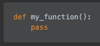
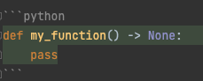
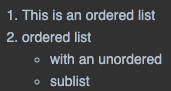
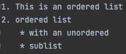
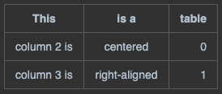
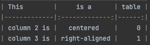

# markdown cheatsheet


| original                                | markdown                                       |
|-----------------------------------------|------------------------------------------------|
|           | ```# header 1```                               |
|           | ```## header 2```                              |
|           | ```### header 3```                             |
|           | ```#### header 4```                            |
|           | ```##### header 5```                           |
|           | ```###### header 6```                          |
| _italics_                               | ```*italics* or _italics_```                   |
| **bold**                                | ```**bold** or __bold__```                     |
| ~~strikethrough~~                       | ```~~strikethrough~~```                        |
| [url](https://www.sebastianhumberg.xyz) | ```[url](https://www.sebastianhumberg.xyz)``` |
| `code`                                  | ``` `code` ```                                 |
|           | ```> blockquotes```                            |
|           | ``` --- ```                                    |
|           |                |
|         | ``` ```        |
|         |                |
|         |                |


