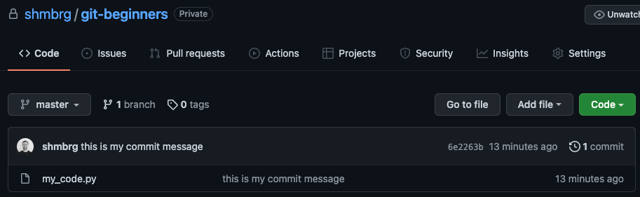
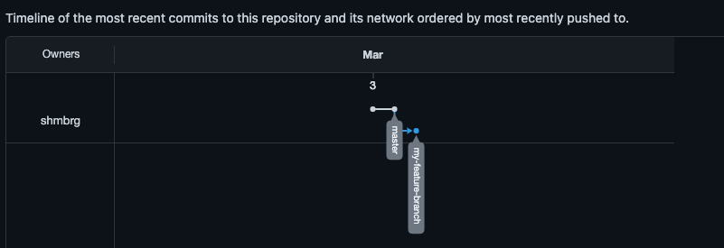
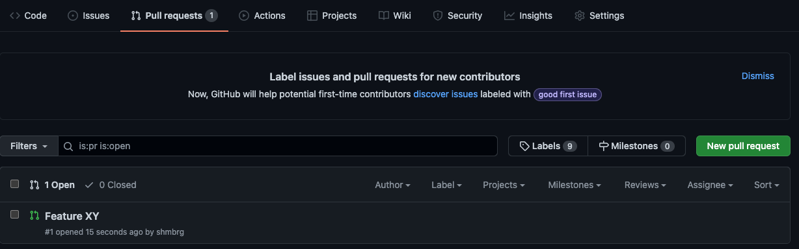
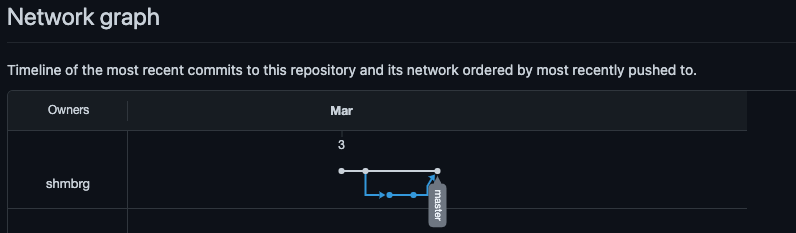

# git-beginners

---
### What are the goals here?
* understand version control and its benefit
* interact with CLI tools in the terminal
* get to know `git` basics
  * `add`, `commit`, `push`, `pull`
  * `branch`, `checkout`
  * PR merge

---
### Prerequisites
* `brew install gh` (GitHub CLI to interact with GitHub)
* `brew install git` (Version control software)
* GitHub account
* (all `gh` interaction can also be performed in the GitHub UI)

---
### About version control
This is a beginners guide to understand the fundamentals of version 
control with `git` within the terminal. We also make use of GitHub for viewing purposes.

Version control lets you keep track of different versions of your project/code.
Essentially you have a **remote repository** where you will store your
code. Whenever you work locally with your code, you will update the 
remote repository at some point, in order to track your changes centralized.
This will give you the advantage of not only versioning your changes, but 
also lets you collaborate on the same code with different developers.
Think of the remote repository as a cloud service. You will find more 
information about version control systems [here](https://git-scm.com/book/en/v2/Getting-Started-About-Version-Control).

---
### 1. Create remote repository

In order to make use of `git`, we will need a remote repository. We will
host this on GitHub (you can also think of GitLab, Bitbucket,..). First
authorize `gh` with your GitHub account. Follow the instructions.

```
> gh auth login
```

Now create a private remote repository on GitHub. This will also clone 
the remote repository locally, this instance is called local repository. 

```
> gh repo create git-beginners --private --clone
```

To switch into your freshly created git repository use `cd` (change directory).

```
> cd git-beginners
```

Have a look inside with `ls` (long listing). It will show you an empty 
directory.

```
> ls

```

What you won't see (unless you've configured your terminal accordingly) is,
that you're locally on a specific branch already. More on this later.

---
### 2. Push your first file

As you will now work on your data project, you are locally developing 
your code. To make sure that you can understand your changes (e.g. you
might want to go back to a certain point of your code), you should 
frequently push your changed code to the remote repository. We will 
mimic this with a single file (`nano` is an editor, which lets you create
a file, in our case, since there is no file in our directory called 
`my_code.py`, it will create such a file on the fly).

```
> nano my_code.py

```
Enter some code and save the file with `ctrl + x`.

```
def my_function():
    pass
```

We now have created new code, which we want to keep track of in our 
remote repository. But first lets check the status of our local 
repository with

```
> git status
```

This will show you, that we have an unversioned file. In order to 
push this now, we need to interact with `git`.
This is a 3 step process. First we need to mark the files, that are 
going to be pushed to the remote repository.

```
> git add my_code.py
```

You can add more files by simply extending the command to 
`git add first_file.py second_file.py ..` or more general add all changed
files with `git add .`.

Check again with `git status` to see, that we now have marked our file.
In the second step we commit all the files, that we have marked 
previously. This way all changes spread over multiple files will be 
grouped together in one commit. Think of adding a feature to your model,
where you had to adjust your code in different files, but essentially
they all belonged to this feature. Commiting changes will always ask you
to add a commit message (`-m` flag). Use something you will recognize in the future.

```
> git commit -m "this is my commit message"
```

The last step will be pushing our commits to the remote repository. 
Remember, that earlier we said we are on a specific branch already. 
This default branch is usually called `master` (or `main`). Check this 
with `git branch`. Since this branch is only locally (verify, that there 
is no branch on GitHub), we will need to make sure, that our remote
repository is aware of our local branch. This has to be done only once,
afterwards it is set. You can do this with the `--set-upstream` flag.

```
> git push --set-upstream origin master
```

Once this is done, `git push` will suffice. Notice the comment when pushing:
**Branch 'master' folgt nun 'origin/master'.** This means our local branch
`master` is now linked to the remote branch `origin/master`.

You have now successfully pushed your first commit to your project. 
You can verify this by visiting the GitHub page of your repository.



---
### 3. Create a feature branch

Imagine your code in your remote repository is being used in a production
system. This can mean you have developed a ml model with specific features. 
Obviously this model has to be retrained from time to time, so your code
will need to stay as it is for now. However because you've gathered new data,
you want to iterate your model with a new feature. Since your already 
existing code for your model works well and needs to continue working 
because of the retraining, you need to create an environment, where you 
can further develop your code, but not break existing one. For this there 
is the concept of a `branch`. A new branch will be in the first step just
a copy of your existing `master` (or `main`) branch. But when you develop
your code, it will start creating differences. For a better understanding
take a moment and study this branch visualization.



This visualization shows commits to the `master` branch, as well as to
the `my-feature-branch`. To achive this, we will create a new branch and
switch our default branch to the new branch.

```
> git branch my-feature-branch
> git checkout my-feature-branch
```

We will now add a new feature to our existing `my_code.py` file, e.g.

```
> nano my_code.py


def my_function():
	pass

def my_feature_function():
	pass
```

Now follow the same procedure as in step 2. Remember, since we are on a 
new branch now, we will need to set the upstream again, as the remote
repository is not yet aware of our new feature branch. 

Once you are done with this step check your GitHub repository at 
_Insights_ > _Network_. This will show you the graph from above
(unfortunately, this is only available for public repositories).

---
### 4. Open a pull request

In order to add your feature from your feature branch into the existing
productionized model training, you will open a Pull Request (PR). A PR is
essentially an inquiry to the owner(s) of the repository to make a change
to the active code. Since you have added a new feature, someone (or better:
some automated tests) will make sure, that your changes won't break existing
code. 

Open up a PR with

```
> gh pr create --title "Feature XY" --body "Added a new feature to our model"
```

You can now see the PR in the accoring section on GitHub.



You can also add reviewers to your PR, this will speed up the process of 
code inspection and testing in real life.

---
### 5. Merge your feature branch into your master branch

Once your feature got accepted, you will now merge `my-feature-branch`
into `master`. This step might be clearer if its done in the GitHub UI,
but for the sake of this guide we'll be doing it with `gh` as well.

```
> gh pr merge
```

This will ask you a few questions, you can always go with the first option.
Since our feature is now merged into `master`, we can now observe a closed
cycle in our network graph.



This means, that our feature is added to the basis.

---
### 6. Pull changes

Since so far we have developed our feature locally, obviously, our local code
is the same than the remote code, that we pushed there. However imagine
the case, that a colleague added this feature, which is now on `master`.
In this case, we will need to update our local `master` in order to 
further develop our code. This can simply by done by

```
> git checkout master
> git pull
```

This will pull all changes which are checked into the remote repository
(Remember to switch to the `master` branch, if not already done, since 
otherwise you might pull from a different upstream).


